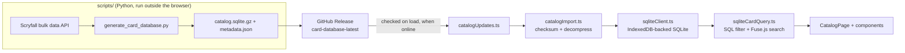

# Architecture

Cardscade (magic_catalog) is a client-only, offline-first Magic: The Gathering
card browser. There is no application backend — all card data ships as a
prebuilt SQLite database that runs in the browser via SQLite WASM, and the app
itself is a static site (React + Vite) deployed to GitHub Pages.

See also: [doc/database/offline-catalog.md](database/offline-catalog.md) and
[doc/database/storage.md](database/storage.md) for the original design notes
behind the offline catalog, and [doc/components/](components/) /
[doc/views/](views/) for diagrams and UI mockups.

## Tech stack

- **UI**: React 19 + React Router, Vite 8, TypeScript
- **Data**: SQLite compiled to WASM ([sql.js](https://github.com/sql-js/sql.js)), persisted in IndexedDB
- **Search**: [Fuse.js](https://www.fusejs.io/) fuzzy matching layered over SQL-filtered candidates
- **PWA**: `vite-plugin-pwa` for offline install/caching
- **Data generation**: standalone Python scripts against the Scryfall API
- **CI/CD**: GitHub Actions (scheduled database publishing, GitHub Pages deploy)
- **Tests**: Vitest + Testing Library (jsdom), plus a separate integration project against a real database snapshot

## High-level data flow

1. **Generation (offline, not part of the running app)**:
   [scripts/generate_card_database.py](../scripts/generate_card_database.py)
   pulls Scryfall's bulk `all_cards`/rulings data and writes a normalized
   SQLite database (`catalog.sqlite.gz`) plus `metadata.json` (checksum,
   counts, schema/artifact version) to `artifacts/card-database/`.
2. **Publishing**: [.github/workflows/card-database.yml](../.github/workflows/card-database.yml)
   runs that script on a weekly schedule (or manually) and publishes the two
   files to the `card-database-latest` GitHub Release. A separate frozen
   `card-database-test` release exists purely for integration tests (see
   [Testing](#testing) below) and is never auto-updated.
3. **First load / updates**: [catalogUpdates.ts](../src/services/catalogUpdates.ts)
   bootstraps from a small embedded "starter" database under
   [public/card-database/bootstrap](../public/card-database/bootstrap) when no
   local catalog exists yet, then checks `card-database-latest` for a newer
   database when online (comparing checksums). All of this is optional —
   once a catalog is stored locally, the app works fully offline.
4. **Import**: [catalogImport.ts](../src/services/catalogImport.ts) decompresses
   the gzip payload (if needed), verifies its SHA-256 checksum against
   `metadata.json`, and hands the raw SQLite bytes to `sqliteClient.ts`.
5. **Storage**: [sqliteClient.ts](../src/db/sqliteClient.ts) loads the bytes into
   an in-memory `sql.js` `Database` and persists the raw bytes (plus metadata)
   in IndexedDB (`magic-catalog-sqlite`), so subsequent app loads skip the
   network entirely.
6. **Querying**: [sqliteCardQuery.ts](../src/services/sqliteCardQuery.ts) runs
   SQL for set/rarity filters (using the database's indexes), applies type/color
   filtering in JS, and layers Fuse.js fuzzy search over the result for
   free-text queries. Results and Fuse indexes are cached per filter
   combination for the lifetime of the loaded database.
7. **Rendering**: [CatalogPage.tsx](../src/pages/CatalogPage/CatalogPage.tsx) owns
   query/sort/filter state, parses the search bar's Scryfall-like query syntax
   via [scryfallQuery.ts](../src/utils/scryfallQuery.ts), and renders results
   through its `components/` (List, Cards, Pagination, SearchBar, CardModal).

## Frontend structure

- [src/main.tsx](../src/main.tsx) / [src/App.tsx](../src/App.tsx) — app entry
  point and routing (`react-router-dom`, single `/catalog` route).
- [src/App/components/](../src/App/components) — app-shell chrome shared
  across pages: `AppHeader`, `Navigation`, `InstallPopup` (PWA install prompt).
- [src/pages/CatalogPage/](../src/pages/CatalogPage) — the entire product
  surface today:
  - `components/SearchBar` — free-text input plus basic/advanced filters
    (color, type, rarity, set), parsed to/from the query string via
    `utils/scryfallQuery.ts`.
  - `components/List` → `components/Cards` — virtualized-ish card list and
    per-card rendering (mana cost symbols, oracle text expansion).
  - `components/Pagination` — batches results client-side (`BATCH_SIZE`).
  - `components/CardModal` — card detail view and rulings modal.
- [src/services/](../src/services) — application/business logic decoupled from
  React: `catalogImport.ts`, `catalogUpdates.ts`, `sqliteCardQuery.ts`, `rulings.ts`.
- [src/db/sqliteClient.ts](../src/db/sqliteClient.ts) — the only module that
  talks to IndexedDB/sql.js directly.
- [src/utils/](../src/utils) — pure helpers: query string parsing
  (`scryfallQuery.ts`), color-matching rules (`cardColors.ts`), symbol/type
  filter helpers (`cardFilters.ts`, `utils.ts`).
- [src/types/](../src/types) — shared `Card`/`Catalog*` type definitions.

## Testing

- **Unit/component tests** ([vitest.config.ts](../vitest.config.ts)): run via
  `npm test`, using an in-memory sql.js database seeded from
  [src/data/mockCards.ts](../src/data/mockCards.ts)
  (see [src/test/catalogFixture.ts](../src/test/catalogFixture.ts)). Fast,
  deterministic, no network access.
- **Integration tests** ([vitest.integration.config.ts](../vitest.integration.config.ts)):
  run on demand via `npm run test:integration`. They download the frozen
  `card-database-test` GitHub Release (full ~80k-card catalog) with
  [scripts/fetch_test_database.py](../scripts/fetch_test_database.py) and
  exercise the real `importCatalogArtifact` → `queryCards` path with
  representative query shapes
  ([src/test/integrationQueries.ts](../src/test/integrationQueries.ts)),
  asserting correctness and logging per-query timings.

## Build & deploy

- `npm run dev` / `npm run build` — Vite dev server / production build
  (`tsc -b && vite build`), base path `/magic_catalog/`.
- [.github/workflows/deploy.yml](../.github/workflows/deploy.yml) — builds on
  push to `main`, downloads the latest `card-database-latest` release assets
  into `dist/card-database`, and publishes to GitHub Pages.
- [.github/workflows/card-database.yml](../.github/workflows/card-database.yml) —
  regenerates and republishes `card-database-latest` on a weekly schedule
  (the card database artifact and the app code deploy independently).
